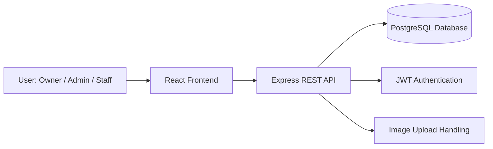
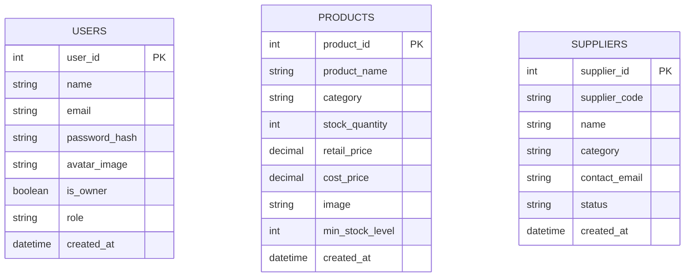
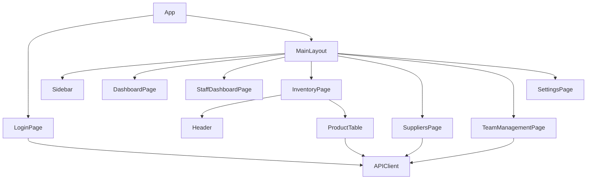

# SwiftStock Inventory Management System

## Project Report

### Course

CSE412

### Project Title

SwiftStock Inventory Management System

### Team

Add team member names, IDs, and roles here.

### Repository

https://github.com/SFKNiloy007/SwiftStock-Inventory-System

### Submission Date

March 15, 2026

---

## 1. Introduction

SwiftStock Inventory Management System is a web-based inventory and shop operations platform designed to help a retail business manage products, supplier information, stock levels, team accounts, and day-to-day sales activity. The system was developed to reduce manual stock tracking, improve visibility into low-stock situations, and enforce role-based access for different shop employees.

The application has two major parts:

- A React-based frontend for the user interface.
- An Express and PostgreSQL backend for authentication, business logic, and data persistence.

The current major release extends the project substantially beyond the initial prototype. It now supports secure login, Owner/Admin/Staff access separation, product sales with dynamic stock reduction, low-stock notifications, supplier management, team management, protected account ownership, and customizable branding on the login screen.

---

## 2. Problem Statement

Small and medium retail shops often manage stock, suppliers, employee access, and sales records manually or with disconnected tools. This causes several operational problems:

- Product stock is not updated immediately after sale.
- Low-stock situations are noticed too late.
- Different staff members may gain access to sensitive functions without proper restrictions.
- Supplier information is difficult to search, update, and maintain.
- Management cannot easily monitor team access and operational activity.

SwiftStock addresses these issues by providing a centralized inventory management environment with role-based permissions and operational automation.

---

## 3. Project Objectives

The main objectives of SwiftStock are:

- To manage products and stock efficiently in a single system.
- To provide role-based access for Owner, Admin, and Staff users.
- To reduce stock dynamically when sales occur.
- To notify users when stock reaches a low threshold.
- To maintain supplier and team member information securely.
- To provide a responsive and easy-to-use graphical interface.
- To create a foundation that can be extended with analytics, full sales persistence, and broader reporting.

---

## 4. Scope of the Current Release

The current major release includes the following functional scope:

- Authentication with JWT-based login.
- Owner, Admin, and Staff role support.
- Protected Owner account that cannot be deleted.
- Product listing, search, add, and sell operations.
- Dynamic stock update after product sale.
- Low-stock alert popups.
- Supplier create, status update, search, and delete operations.
- Team management with role assignment and protected Owner restrictions.
- Login screen branding customization.
- Settings page support for an Admin/Owner-managed login image.

Out of current release scope:

- Full persistent sales transaction history in the database.
- Advanced analytics based on transactional sales tables.
- Multi-branch or multi-store support.
- Real-time synchronization across multiple browsers.

---

## 5. User Stories

### 5.1 Functional User Stories

- As a Store Owner (Marjan), I want a secure login system so that unauthorized persons cannot access business data.
- As a Staff Member, I want to search and select products from the system instead of manual entry so that I can complete sales quickly and accurately.
- As a Store Owner (Marjan), I want to hide cost price from staff so that profit margins remain confidential.

### 5.2 Engineering User Story

- As a Development Team, we want automated unit testing with Jest and CI/CD with GitHub Actions so that releases are reliable and regressions are detected early.

---

## 6. Acceptance Criteria

### 6.1 Secure Login (Store Owner)

1. Given a valid email and password, when login is submitted, then the user is authenticated and redirected to the correct dashboard by role.
2. Given an invalid email or password, when login is submitted, then access is denied and an error message is shown.
3. Given no JWT token, when a protected API is requested, then the server returns unauthorized.
4. Given an expired or invalid JWT token, when a protected API is requested, then the server returns unauthorized.

### 6.2 Staff Product Search and Selection

1. Given a staff user on the products page, when a search term is entered, then matching products are filtered and displayed.
2. Given products are listed, when a staff user clicks Sell, then stock decreases immediately for that product.
3. Given stock is insufficient, when Sell is attempted, then the system blocks the action and shows an error.
4. Given successful sale actions, when multiple products are sold, then updates are reflected without manual page refresh.

### 6.3 Hide Cost Price from Employees (Store Owner)

1. Given a staff user on product listing, then cost price is not visible.
2. Given an owner or admin user on product listing, then cost price is visible.
3. Given a staff user calling restricted product-management APIs, then unauthorized actions are blocked.
4. Given owner or admin role context, then privileged financial views remain available.

### 6.4 Unit Testing and CI/CD (Development Team)

1. Given a pull request or push, when CI runs, then automated tests execute.
2. Given test failures, when CI runs, then the pipeline reports failure.
3. Given passing tests, when CI runs, then the pipeline reports success.
4. Given backend changes, then at least smoke and unit tests for auth and core routes are maintained and executable via npm test.

---

## 7. Technology Stack

### Frontend

- React 18
- TypeScript
- Vite
- Tailwind CSS
- Radix UI components
- Axios
- React Router
- Sonner for popup notifications

### Backend

- Node.js
- Express.js
- PostgreSQL
- pg
- JWT (`jsonwebtoken`)
- `bcryptjs`
- `express-validator`
- `multer`

### Testing

- Jest
- Supertest

### Deployment

- Render

---

## 8. System Architecture

SwiftStock follows a client-server architecture.

- The frontend is responsible for routing, UI rendering, role-based screen visibility, and user interaction.
- The backend exposes REST APIs for authentication, products, suppliers, and team management.
- PostgreSQL stores users, products, and suppliers.
- JWT tokens are used for authenticated API access.

### 8.1 High-Level Architecture Diagram

---

## 9. Database Design

The backend currently manages three main tables: `users`, `products`, and `suppliers`.

### 9.1 Entity Relationship Diagram

### 9.2 Table Design Summary

#### Users Table

- Stores system users.
- Uses `role` and `is_owner` together to distinguish Staff, Admin, and Owner.
- Passwords are stored as secure hashes.

#### Products Table

- Stores product identity, pricing, and stock levels.
- Includes `min_stock_level` for low-stock alert logic.

#### Suppliers Table

- Stores supplier identity and sourcing status.
- Uses `supplier_code` as a human-readable unique identifier.

---

## 10. Class / Component Design

Although the frontend is built with functional React components rather than traditional OOP classes, the project still has a clear component structure.

### 10.1 Major Frontend Components

| Component                | Purpose                                                           |
| ------------------------ | ----------------------------------------------------------------- |
| `App.tsx`                | Main router, role persistence, authenticated route control        |
| `LoginPage.tsx`          | Authentication UI and recovery flows                              |
| `MainLayout.tsx`         | Shared application shell                                          |
| `Sidebar.tsx`            | Role-based navigation                                             |
| `InventoryPage.tsx`      | Product operations, stock updates, low-stock notification logic   |
| `ProductTable.tsx`       | Product listing, sell button, CSV export                          |
| `TeamManagementPage.tsx` | Team creation, editing, role control, Owner protection visibility |
| `SuppliersPage.tsx`      | Supplier CRUD-style actions and status management                 |
| `SettingsPage.tsx`       | Configuration and login image customization                       |

### 10.2 Major Backend Modules

| Module                | Purpose                                              |
| --------------------- | ---------------------------------------------------- |
| `auth.routes.js`      | Login, registration, emergency login, password reset |
| `products.routes.js`  | Product search, add, sell, flush                     |
| `suppliers.routes.js` | Supplier load, create, status update, delete         |
| `team.routes.js`      | Team list, create, edit, delete                      |
| `auth.js` middleware  | JWT verification and admin-level access restriction  |
| `bootstrapData.js`    | Ensures default privileged account exists            |

### 10.3 Component / Module Diagram

---

## 11. UI / GUI Design

The UI was designed to be simple, modern, and role-aware.

### 11.1 Design Goals

- Clear separation between navigation and content.
- Responsive layouts for desktop and smaller screens.
- Visual emphasis on stock status and operational actions.
- Distinct role-based visibility for sensitive actions.
- Friendly login and branding experience.

### 11.2 Important UI Features

- Role-specific navigation in the sidebar.
- Dashboard and inventory pages with card-based summaries.
- Search and filter support for product and supplier lists.
- Color-coded stock and supplier status indicators.
- Popup notifications for low stock.
- Customized login screen with brand wordmark and configurable image.

### 11.3 Usability Considerations

- Staff can perform day-to-day sales tasks without seeing restricted management operations.
- Owner/Admin controls are visually present only where appropriate.
- Destructive actions, such as deleting suppliers, require direct user intent.

---

## 12. Security and Access Control

The system includes several access-control and security measures:

- JWT-based authentication for protected endpoints.
- Password hashing using bcrypt.
- Role-based backend authorization for Admin/Owner-only routes.
- Prevention of unauthorized Admin self-registration.
- Owner account protection from deletion.
- Removal of unsafe hardcoded fallback behaviors.
- Security-oriented environment variable validation on startup.

### 12.1 Role Matrix

| Capability           | Owner | Admin | Staff |
| -------------------- | ----- | ----- | ----- |
| Login                | Yes   | Yes   | Yes   |
| View products        | Yes   | Yes   | Yes   |
| Sell products        | Yes   | Yes   | Yes   |
| Add products         | Yes   | Yes   | No    |
| Flush products       | Yes   | Yes   | No    |
| Manage suppliers     | Yes   | Yes   | No    |
| Manage team          | Yes   | Yes   | No    |
| Change login image   | Yes   | Yes   | No    |
| Delete Owner account | No    | No    | No    |

---

## 13. Design Patterns Used

Two design patterns were applied in the project structure and logic.

### 13.1 Pattern 1: Strategy Pattern

The project uses a role-based behavior strategy to determine what each type of user can do. Instead of hardcoding one fixed behavior for all users, the system changes permitted actions based on the active role.

#### Where it appears

- Frontend route and UI behavior in `App.tsx`
- Role-based navigation in `Sidebar.tsx`
- Role-based inventory and settings behavior in `InventoryPage.tsx` and `SettingsPage.tsx`
- Backend access rules in `auth.js`

#### Why it is a Strategy Pattern

The same operations are handled differently depending on which role strategy is active:

- Staff strategy: view products and sell only
- Admin strategy: management plus operational access
- Owner strategy: full privileged access with protected identity

This improves maintainability because role-specific logic is centralized rather than duplicated randomly across the application.

### 13.2 Pattern 2: Factory Pattern

The backend uses centralized object creation logic to build API-facing user/auth response objects instead of reconstructing them manually in each route.

#### Where it appears

- `createAuthPayload(user)` in `auth.routes.js`
- Role mapping helpers such as `toApiRole(row)` in `team.routes.js`

#### Why it is a Factory Pattern

These functions encapsulate object creation rules:

- Convert database-specific role data into API role labels
- Build a consistent authentication response structure
- Ensure a single source of truth for object shape returned to the frontend

This improves consistency and reduces duplicated transformation logic.

---

## 14. Development Features Implemented So Far

The following major features have been implemented in the project:

- Secure login and session persistence
- Emergency login and password reset flow
- Owner/Admin/Staff role-based control
- Owner account protection
- Team management with role assignment
- Supplier management with create, status toggle, and delete
- Product search and pagination-ready loading
- Product creation by Owner/Admin only
- Product selling by all authenticated users
- Dynamic stock reduction after sale
- Low-stock popup alerts
- CSV export for product data
- Login screen branding and custom image management
- Protected production behavior for branding changes

---

## 15. Initial Unit Testing

Initial automated testing has been set up using Jest and Supertest in the backend.

### 15.1 Current Testing Tools

- Jest for test execution
- Supertest for API and application route testing

### 15.2 Initial Test Coverage Implemented

The current test suite includes smoke and environment verification tests:

- `GET /login` route accessibility
- `GET /dashboard` route accessibility / redirect behavior
- Mock database connection verification

### 15.3 Test Execution Result

The current test suite passes successfully.

Example result summary:

- Test Suites: 1 passed
- Tests: 3 passed
- Status: Successful

### 15.4 Testing Significance

Although the current test coverage is still initial rather than complete, it establishes the backend testing pipeline and confirms:

- Application bootstrapping works correctly
- Core routing is reachable
- Database connection code is testable

Future testing can expand into:

- Owner deletion protection tests
- Product sell endpoint tests
- Staff restriction tests for product creation
- Supplier delete route tests
- Authentication failure and token validation tests

---

## 16. Git and Version Control

All development work has been tracked through Git and pushed to the remote repository.

### 16.1 Version Control Practices Used

- Incremental commits after meaningful features
- Frequent pushes to GitHub
- Verification through build/test before push for critical changes

### 16.2 Examples of Recently Completed Features in Git History

- Owner role with deletion protection
- Staff restriction on product creation
- Sell button with dynamic stock update and low-stock alerts
- Supplier deletion support

This ensures traceability and accountability for both development and testing changes.

---

## 17. Customer Feedback After Major Release

This section should summarize the customer feedback gathered after the major release.

### 17.1 Video Submission Link

Add customer feedback video link here:

`[Insert Google Drive / YouTube / OneDrive link]`

### 17.2 Feedback Summary Template

| Feedback Area       | Customer Comment   | Action Taken / Planned |
| ------------------- | ------------------ | ---------------------- |
| Ease of login       | Add actual comment | Add actual action      |
| Product selling     | Add actual comment | Add actual action      |
| Stock alerts        | Add actual comment | Add actual action      |
| Supplier management | Add actual comment | Add actual action      |
| UI clarity          | Add actual comment | Add actual action      |

### 17.3 Reflection on Feedback

Write a short paragraph here describing:

- What the customer liked most
- What problems or suggestions were raised
- Which improvements were immediately implemented

---

## 18. Feature Demonstration Video

This section documents the required demonstration video of all features developed so far.

### 18.1 Video Submission Link

Add feature demo video link here:

`[Insert Google Drive / YouTube / OneDrive link]`

### 18.2 Suggested Demo Flow

The demonstration should include:

1. Project introduction
2. Login with Owner/Admin/Staff roles
3. Product inventory operations
4. Sell button and dynamic stock update
5. Low-stock warning popup
6. Supplier create, status update, and delete
7. Team management and Owner protection
8. Branding customization on login page
9. Major backend code sections
10. Major frontend code sections
11. Automated testing and Git history

---

## 19. Major Code Sections to Show in the Demo

Recommended code areas to present in the video:

- `src/app/App.tsx` for routing and role-aware navigation
- `src/app/components/InventoryPage.tsx` for stock and sales logic
- `src/app/components/ProductTable.tsx` for sell action UI
- `src/app/pages/TeamManagementPage.tsx` for Owner/Admin role behavior
- `backend/src/routes/auth.routes.js` for authentication logic
- `backend/src/routes/products.routes.js` for add and sell API logic
- `backend/src/routes/team.routes.js` for Owner protection and role control
- `backend/src/routes/suppliers.routes.js` for supplier CRUD-style operations
- `backend/schema.sql` for database structure
- `backend/tests/app.test.js` for initial automated testing

---

## 20. Major Achievements of This Release

This release significantly improved the project in the following ways:

- The system moved from basic inventory listing to operational stock handling.
- Shop hierarchy is now better represented through Owner/Admin/Staff roles.
- Sensitive operations are better protected.
- Supplier and team management are more complete.
- The system now provides better usability through alerts and guided actions.
- The UI branding is more professional and customizable.

---

## 21. Limitations and Future Work

The current implementation still has some limitations that can be improved in future development:

- Sales history is not yet fully persisted from sell operations.
- Analytics can be made data-driven from stored sales transactions.
- Test coverage should be expanded beyond smoke tests.
- Reporting dashboards can be enriched with live business insights.
- File/image management can be centralized beyond browser-local persistence.

Future improvements may include:

- Persistent sales transaction table
- Real-time dashboard analytics
- Notification center
- Role audit logging
- Multi-store support

---

## 22. Conclusion

SwiftStock Inventory Management System has evolved into a practical role-based inventory platform that supports secure authentication, stock management, supplier operations, team management, and dynamic sales handling. The major release introduced important architectural, security, and usability improvements, including Owner protection, low-stock alerts, and operational restrictions based on role.

The project is now in a stronger state for demonstration, customer review, and further academic evaluation. With continued improvements to testing, transaction persistence, and reporting, SwiftStock can grow into a more complete retail operations platform.

---

## Appendix A: Suggested Screenshots to Add Before Final Submission

- Login page with SwiftStock branding
- Owner/Admin dashboard
- Staff dashboard
- Product inventory page
- Sell button and low-stock popup
- Supplier management page
- Team management page
- Settings page with login image management

## Appendix B: Suggested Team Work Log Summary

Add a short work log for each member, especially if faculty asks for evidence of individual contribution:

| Team Member | Main Contributions | Estimated Hours |
| ----------- | ------------------ | --------------- |
| Member 1    | Add real details   | Add hours       |
| Member 2    | Add real details   | Add hours       |
| Member 3    | Add real details   | Add hours       |
